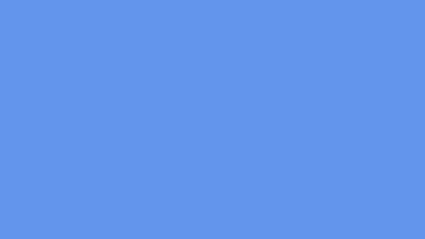
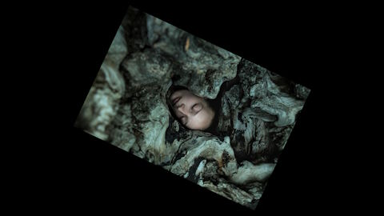
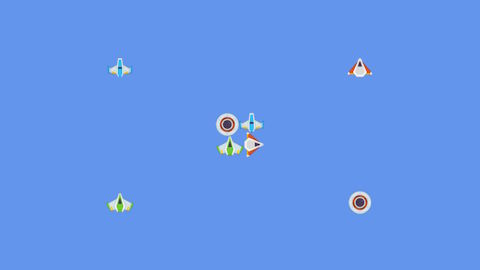
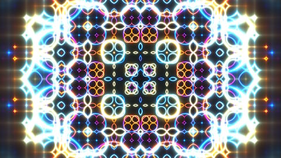
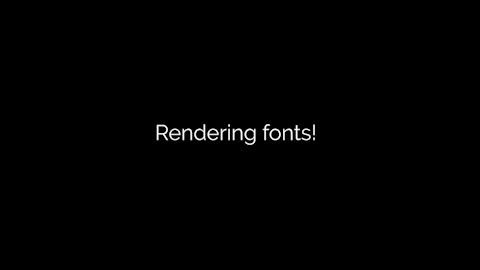

# Examples
This folder contains some examples of how the various features of Lucky are used.

Note: To run these examples in Visual Studio, you'll need to set the working directory.  
Set `Project Properties` > `Debugging` > `Working Directory` to the value `$(ProjectDir)../../../Assets/Examples`

Alternatively, you can copy the assets each example is trying to load into the folder where the vcxproj file lives. (Because `$(ProjectDir)` is the default working directory.)

## Graphics

### Clear Screen
Basic OpenGL setup. Create a [GraphicsDevice](../Include/Lucky/Graphics/GraphicsDevice.hpp) and clear the screen to Cornflower Blue.  

### Textures
Build on the Clear Screen example by creating a [BatchRenderer](../Include/Lucky/Graphics/BatchRenderer.hpp) and loading a [Texture](../Include/Lucky/Graphics/Texture.hpp), then displaying it rotating in the center of the screen. The texture used is this photo by [Стас Кадрулев](https://unsplash.com/photos/a-person-is-hiding-in-a-tree-trunk-pkAt6ylvkic).  

### Texture Atlas
Build on the Texture example by loading up a [TextureAtlas](../Include/Lucky/Graphics/TextureAtlas.hpp). The format of the texture atlas is Json Array file format exported by Code and Web's [Texture Packer](https://www.codeandweb.com/texturepacker). The sprites used are from Kenney's [Space Shooter Redux](https://kenney.nl/assets/space-shooter-redux) pack.  

### Shaders
Create a [ShaderProgram](../Include/Lucky/Graphics/ShaderProgram.hpp) from a VertexShader and FragmentShader, then render to the screen using that program. The fragment shader used here is from this [very cool tutorial](https://youtu.be/f4s1h2YETNY?si=0uaeJnbRjqDrODS_). (Go watch that thing, it's awesome!)  

### Fonts
This example loads a truetype [Font](../Include/Lucky/Graphics/Font.hpp), creates a font entry with oversampling enabled, and renders a string. Font rendering is super barebones right now. It supports texture packing, oversampling, and kerning, because those are included in [stb_truetype](https://github.com/nothings/stb/blob/master/stb_truetype.h), but some layout functionality is definitely needed. The font used in this example is [Raleway Normal](https://www.fontsquirrel.com/fonts/raleway).   

